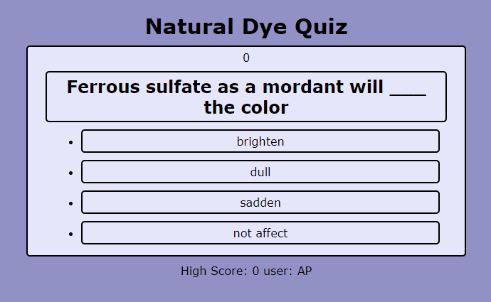

# Natural Dye Quiz
## About
I'm this project, I created a quiz using html, css, and javascript. When you press start, the questions appear and a timer counts down. There is a time penalty for incorrect answers. Upon completion, the user enters their initials and their score is logged. 
## Screenshots
.png)

## Links
Open [https://potteramy.github.io/naturaly-dye-quiz/](https://potteramy.github.io/naturaly-dye-quiz/) with your browser to see the result.